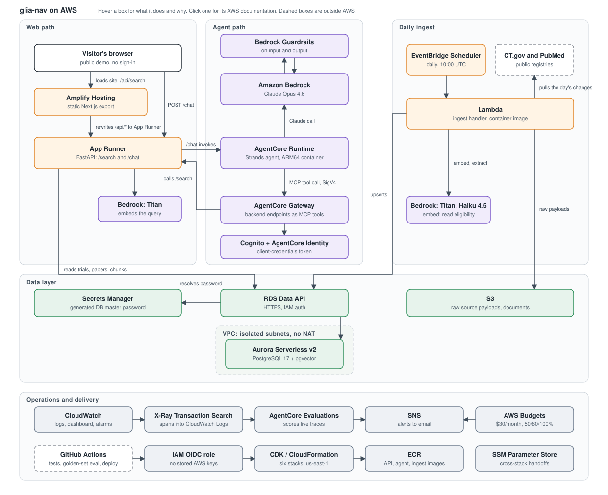

# glia-nav

**Live demo: https://main.d1zp4oaz4g1yvk.amplifyapp.com**

## Why I built this

A close family member was recently diagnosed with glioblastoma. Within days, the rest of us were
scrambling to understand the disease, what treatments exist, and which clinical trials they might be
able to join. The answers are public, but they are spread across ClinicalTrials.gov, PubMed, and
eligibility criteria written for clinicians, and pulling them together took hours nobody had.

glia-nav is the tool I wanted that week. It searches every glioblastoma trial and paper in one
place, filters trials by what is on a pathology report (IDH and MGMT status, recurrence,
performance status), and answers plain questions with citations to the trials and papers behind
them. It is built to be quick and to be kind: it gives the general evidence and leaves decisions
about one person's care to their oncology team.

It is also a portfolio project. I used a real need to show how I build with AWS, LLMs, Python, and
CI:

- **AWS:** CDK in Python, Bedrock (Claude Opus 4.6 and Haiku 4.5), AgentCore Runtime and Gateway,
  Aurora Serverless v2 with pgvector, App Runner, Lambda, Amplify.
- **LLMs:** a chat agent that searches through an MCP gateway and cites only what it found; Haiku
  reading trial eligibility into structured fields, with its answers checked in code against quotes
  from the criteria.
- **Python:** FastAPI, Strands Agents, Pydantic, uv, pytest.
- **CI:** GitHub Actions with OIDC and no stored AWS keys. Every merge runs the tests and a
  golden-set eval of the agent before it deploys.

**Research use only. Not medical advice, and not a medical device.** Everything shown is retrieved
from public registries and surfaced by an LLM; it may be incomplete, outdated, or wrong. Do not use
any output for patient care decisions. Verify eligibility and treatment options with the oncology
team before acting on anything here.

## Status

Live as a public demo since 2026-09-25, with no sign-in. Six CDK stacks run in `us-east-1`, and
every merge to `main` runs the golden-set evals, deploys the stacks, and ships the frontend. Chat
spend is capped at 150,000 tokens a day and 10 chats an hour per visitor, under a $30 monthly
budget alarm. Search, the chat agent, daily ingest from both sources, and structured eligibility
are built. The known gaps are listed in [`docs/ARCHITECTURE.md`](docs/ARCHITECTURE.md#known-gaps).

## Documentation

| Doc | What's in it |
|---|---|
| [`docs/INSTALL.md`](docs/INSTALL.md) | Prerequisites, local setup, running the API, agent, and frontend on your machine |
| [`docs/ARCHITECTURE.md`](docs/ARCHITECTURE.md) | How the pieces fit, why each AWS service is there, the tradeoffs, the known gaps |
| [`docs/OPERATIONS.md`](docs/OPERATIONS.md) | Deploying, CI/CD, observability, evals, cost, teardown |
| [`docs/SETUP.md`](docs/SETUP.md) | The build record: account and identity setup, the ten build phases, dead ends worth not repeating |
| [`CLAUDE.md`](CLAUDE.md) | Operating rules and settled decisions for Claude Code |

## How it fits together



Hover a box for what it does here and why that service. Each box links to its AWS documentation;
the links work when [the SVG](docs/architecture.svg) is opened on its own, since GitHub renders
README images without them.

## AWS services

Every slot is filled by AWS unless AWS makes nothing that fills it. The full reasoning for each
choice, plus the tradeoffs, is in [`docs/ARCHITECTURE.md`](docs/ARCHITECTURE.md).

| Service | Job here | Why this one |
|---|---|---|
| **Aurora Serverless v2 (PostgreSQL 17 + pgvector)** | Trial and literature records, and their embeddings | One engine for relational and vector data, so there is no second datastore to run. Scales to 0 ACU and auto-pauses after 5 minutes, so an idle dev database costs storage only. |
| **RDS Data API** | Every query path: app, migrations, local scripts | Lets the cluster stay in isolated subnets with no route in or out. Callers authenticate with IAM over HTTPS instead of a network path, so no NAT gateway and no VPC connector are needed. |
| **Secrets Manager** | The generated database master password | The Data API resolves the secret itself from its ARN. The password never reaches the container or `.env`. |
| **S3** | Document storage (pathology reports, cached papers) | Versioned, SSE-S3, public access blocked, TLS enforced, lifecycle to Infrequent Access at 30 days. Reached through a VPC gateway endpoint, which is free. |
| **App Runner** | Runs the FastAPI backend container | A container URL with TLS, health checks, and autoscaling, with no load balancer or cluster to operate. Pinned to exactly one 0.25 vCPU instance, because uncapped scale-out is the largest budget risk in the account. |
| **ECR** | Stores both container images | Where the CDK Docker asset lands. App Runner and AgentCore both pull from it. |
| **Cognito** | User pool for `/me` and the Gateway's client-credentials client | The site has no accounts: `/search` and `/chat` take no token. 12 character password policy, token revocation. |
| **Amplify Hosting** | Serves the static Next.js export | CDN hosting plus the rewrite rule that proxies `/api/*` to App Runner, which is what removes the need for a CORS layer. |
| **Amazon Bedrock** | Model inference | Claude models on AWS-managed infrastructure, invoked through `us.` inference profiles. IAM policies pin invocation to six model IDs and nothing else. |
| **Bedrock Guardrails** | Safety policy on agent input and output | Anonymises names, emails, phone numbers, addresses, and ages; blocks SSN and card numbers. Applied by the service, so it cannot be prompted away. |
| **Bedrock AgentCore Runtime** | Hosts the Strands agent | Serverless agent hosting with session isolation and OTEL tracing built in. No container platform to run for a workload measured in a handful of invocations a day. |
| **AgentCore Gateway** | Publishes backend endpoints to the agent as MCP tools | One OpenAPI target becomes an MCP tool server with SigV4 inbound auth, so tool access is an IAM decision rather than a shared token. |
| **AgentCore Evaluations** | Scores live agent traces for relevance and tool selection | Catches quality drift in production. The local golden set in `evals/` is the pre-deploy gate; this is the post-deploy one. |
| **CloudWatch** | Logs, metrics, dashboard, alarms | One dashboard for invocations, errors, latency, and tokens. Alarms on runtime errors and on a daily token burn above 200,000, both routed to SNS. Every log group is set to 30 day retention explicitly, including the ones services create for themselves. |
| **X-Ray Transaction Search** | Moves agent spans into CloudWatch Logs | AgentCore Evaluations reads traces from the `aws/spans` log group. Without Transaction Search the spans stay in X-Ray and there is nothing to score. |
| **SNS** | Alert fan-out to email | One topic carries budget notifications and both CloudWatch alarms. |
| **AWS Budgets** | $30/month ceiling with alerts at 50, 80, and 100 percent | Tracks gross usage, not net. Promotional credits would otherwise hold net spend at $0.00 and the thresholds could never fire. |
| **IAM + OIDC provider** | GitHub Actions deploy identity | GitHub Actions assumes a role via OIDC with a 1 hour session cap. No access keys exist in the repo or the account. |
| **CloudFormation / CDK** | Every resource above | One CDK app, one stack per concern, everything tagged `project=glia-nav`, `env=dev`, `managed-by=cdk` by an app-level aspect. |

Not AWS, and why: FastAPI and Pydantic (AWS makes no Python web framework), uv/ruff/pytest
(language tooling), Alembic (AWS has no schema migration tool for application tables), Next.js and
Tailwind (Amplify hosts frontends, it does not make one), GitHub Actions (the repo is on GitHub and
OIDC means no stored keys), Docker (an open standard AWS consumes).

New to AWS? [`project-template/aws/SERVICES.md`](https://github.com/toddcreasy/project-template/blob/main/aws/SERVICES.md)
walks through the ten jobs any AWS deployment has to fill, and
[`aws/GOTCHAS.md`](https://github.com/toddcreasy/project-template/blob/main/aws/GOTCHAS.md) covers
the failures worth knowing about in advance.

## Repository structure

```
.
├── src/glia_nav/          Application code. The only thing that ships.
│   ├── api/               FastAPI app: /health, /health/db, /me
│   ├── agents/            Strands agent (agent.py) and its AgentCore entrypoint (server.py)
│   ├── config.py          pydantic-settings; Settings for the API, AgentSettings for the agent
│   └── logging_config.py  JSON formatter, so `extra={...}` fields become CloudWatch metric filters
├── infra/                 CDK app: app.py wires five stacks from stacks/
├── migrations/            Alembic versioned schema changes, run over the Data API
├── frontend/              Next.js + Tailwind, static export, public demo, no sign-in
├── evals/                 Golden set for the agent. Hits Bedrock, so it costs money and is slow.
├── tests/                 Fast tests, no network, no AWS calls
├── scripts/               One-shot operational scripts. Never imported by application code.
├── docs/                  The docs listed above
├── .github/workflows/     ci.yml on pull requests, deploy.yml on merge to main
├── Dockerfile             API image, linux/amd64 for App Runner
├── Dockerfile.agent       Agent image, linux/arm64 for AgentCore (an amd64 image never starts)
├── pyproject.toml         Project definition; uv.lock pins exact versions
└── .env.example           Every variable the app reads, no values
```

Two rules make the layout worth following. `src/` is a package root, not a loose folder, so an
import that works in a test works identically in the container. And `scripts/` is one-way: it may
import from `src/`, nothing in `src/` may import from it.

Which of these are real Python and AWS conventions rather than personal preference:
[`project-template/LAYOUT.md`](https://github.com/toddcreasy/project-template/blob/main/LAYOUT.md).

## Quick start

```sh
uv sync                     # install from the lockfile into .venv
uv run pre-commit install   # one time, wires the git hook
uv run pytest               # fast tests, no network
```

Full prerequisites, environment variables, and how to run each piece locally:
[`docs/INSTALL.md`](docs/INSTALL.md).

## License

Apache 2.0. See [`LICENSE`](LICENSE).
